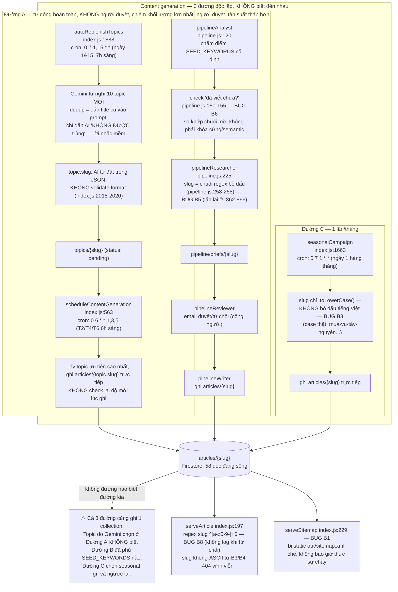

# Phase 3 — Pipeline Architecture & Root-Cause Fix Proposal

> Proposal only — KHÔNG implement ở bước này. Phase 3 luôn đứng sau Phase 1-2 theo nguyên tắc bất biến #1.
> Sinh bởi subagent riêng theo yêu cầu, dựa trên `audit-report.md` (bug B1-B8).

---

## 1. Sơ đồ kiến trúc pipeline thực tế (không phải lý tưởng hóa)



**Chú giải (nhãn trên sơ đồ → số bug trong audit-report.md):**
- "check đã viết chưa" (Đường B) / soft title-dedup (Đường A) → **B6**
- Logic bỏ dấu bị lặp 2 nơi → **B5**
- Slug do AI tự đặt, không validate (`autoReplenishTopics`) → **B4**
- Không bỏ dấu tiếng Việt (`seasonalCampaign`) → **B3**
- `serveArticle` 404 âm thầm khi slug bị từ chối → **B8**
- `serveSitemap` bị che → **B1** (đã phân tích đủ trong audit-report.md §4/§5, không lặp lại ở đây)
- Không có trên sơ đồ: **B2** (bug static sitemap generator) và **B7** (duplicate `contentAnalytics`) — không thuộc luồng sinh nội dung, xử lý ở mục 2.5 dưới.

**Phát hiện sơ đồ này làm rõ mà audit trước chưa nói hết:** có **3 điểm vào sinh bài hoàn toàn độc lập, không biết đến nhau** (autoReplenishTopics+scheduleContentGeneration, chuỗi Analyst/Researcher/Reviewer/Writer trong pipeline.js, và seasonalCampaign), mỗi đường có logic slug riêng và cơ chế check-trùng riêng (đều yếu), cùng ghi vào 1 collection `articles` mà không có sổ đăng ký chung. **Đường A là đường chiếm khối lượng lớn nhất** — chạy tự động 3 lần/tuần không qua người duyệt, so với Đường B chỉ chạy hàng tuần và có người duyệt — đây là lý do số lượng bài gần-trùng lớn như audit đã tìm thấy. Chỉ sửa dedup ở 1 đường mà không sửa cả 3 thì bug vẫn còn nguyên.

---

## 2. Đề xuất sửa tận gốc

### 2.1 Hàm dùng chung `normalizeSlug()` — một nguồn sự thật duy nhất

Tạo `functions/lib/slug.js`:
```js
function normalizeSlug(text) {
  return text.toLowerCase()
    .normalize('NFD').replace(/[̀-ͯ]/g, '')  // bỏ TOÀN BỘ dấu tiếng Việt qua Unicode decomposition —
                                                          // không phải regex chain phải nhớ giữ đầy đủ thủ công (đây
                                                          // chính xác là lý do bug B3 xảy ra)
    .replace(/đ/g, 'd').replace(/Đ/g, 'd')
    .replace(/[^a-z0-9]+/g, '-').replace(/^-+|-+$/g, '');
}
function isValidSlug(slug) { return /^[a-z0-9-]+$/.test(slug) && slug.length > 0; }
module.exports = { normalizeSlug, isValidSlug };
```
Thay cả 4 nơi (`pipeline.js:258-268`, `pipeline.js:862-866`, `index.js:1729` seasonalCampaign, và thêm validate ở `index.js:2018-2020` autoReplenishTopics) bằng lời gọi hàm này. Dùng `String.prototype.normalize('NFD')` thay vì regex chain tự viết tay mới là fix thật cho B3 — bug đó tồn tại chính vì phải nhớ giữ 3 regex chain riêng biệt đồng bộ với nhau, về bản chất không maintain nổi.

### 2.2 Dedup — thay so khớp chuỗi mờ bằng sổ đăng ký topic thật

Vấn đề gốc: kiểm tra độ mới đang so theo **cách diễn đạt** (từ khóa, tiêu đề), không so theo **định danh chủ đề**. Thêm collection `topic_fingerprints`, mỗi topic đã publish/queue 1 doc: `{ canonicalTopic, coreEntities[], slug }`. Trước khi BẤT KỲ đường nào (A hoặc B) chốt 1 topic mới:
- Tính fingerprint cho ứng viên (rẻ nhất: tách cụm danh từ lõi, bỏ từ bổ nghĩa như "kỹ thuật/kinh nghiệm/hướng dẫn", giữ lại chủ đề + vùng/giai đoạn — vd. `{topic: "chọn giống", region: "tây-nguyên"}` cho cả `chon-giong-keo-lai-phu-hop-vung-tay-nguyen` và `lua-chon-giong-keo-lai-phu-hop-khi-hau-tay-nguyen` — 2 bài này PHẢI ra cùng 1 fingerprint).
- Nếu heuristic rẻ không rõ, dùng 1 lần gọi Vertex AI embedding (`text-embedding-004`) so cosine similarity với các fingerprint hiện có, ngưỡng ≥ 0.85 → **chặn cứng trong code**, không chỉ "nhắc AI trong prompt" — nhắc trong prompt chính là cách đang thất bại hiện tại (Đường A đã làm y hệt việc này qua "existingTitles... KHÔNG ĐƯỢC trùng" và vẫn ra bài gần-trùng đều đặn mỗi 2 tuần).
- **Quan trọng**: cả 3 đường (A, B, C) phải cùng check qua 1 module dùng chung `functions/lib/topic-dedup.js` — nếu không, Đường B vẫn có thể tạo lại thứ Đường A đã phủ.

### 2.3 Upsert-not-create — giải quyết định danh topic, không chỉ thao tác ghi

Các lệnh `.set()` theo slug về bản chất ĐÃ LÀ upsert; bug nằm ở **slug không ổn định** giữa các lần chạy cho cùng 1 topic thật. Fix: khi 1 fingerprint (mục 2.2) đã đăng ký, slug của nó bị khóa — nếu lần chạy sau có fingerprint khớp ngưỡng cao, pipeline phải **cập nhật bài đã có** (regenerate nội dung, giữ nguyên slug) thay vì tạo topic/slug mới. Cụ thể: `autoReplenishTopics` và `pipelineAnalyst` phải query `topic_fingerprints` trước; nếu khớp cao, hoặc bỏ qua (nếu bài còn mới) hoặc đưa vào hàng đợi "cập nhật bài {slug}" thay vì "topic mới" — cần 1 code path mới (`pipelineUpdater` hoặc mở rộng `pipelineWriter` với tham số `existingSlug`), hiện chưa có ở cả 2 pipeline.

### 2.4 Guard test — Vertex AI nằm trong luồng nên phải mock

Tách logic thuần (tính slug, check fingerprint/similarity, quyết định "có nên bỏ qua không") ra khỏi HTTP handler thành hàm test được trong `functions/lib/topic-dedup.js` và `functions/lib/slug.js` — cũng là good practice vì hiện tại toàn bộ logic đang nằm inline trong file `index.js` dài 3600 dòng. Test:
```js
// functions/lib/__tests__/topic-dedup.test.js
test('chạy dedup check 2 lần trên cùng 1 topic ứng viên → lần 2 báo "đã phủ"', async () => {
  const fakeDb = createFakeFirestore(); // stub Firestore trong bộ nhớ, không gọi mạng/Vertex thật
  const candidate = { title: 'Chọn giống keo lai phù hợp cho vùng Tây Nguyên', slug: 'chon-giong-...' };
  const first = await evaluateTopicNovelty(candidate, fakeDb);   // kỳ vọng: NOVEL, đăng ký fingerprint
  const rephrased = { title: 'Lựa chọn giống keo lai phù hợp với điều kiện khí hậu Tây Nguyên' };
  const second = await evaluateTopicNovelty(rephrased, fakeDb);  // kỳ vọng: DUPLICATE, bị chặn
  expect(second.status).toBe('duplicate');
});
```
Không cần gọi Vertex AI thật cho test này — hàm tính embedding/similarity nên inject được (truyền vào 1 hàm chấm điểm similarity, mặc định gọi embedding thật ở production, stub trả cosine score đã biết trước ở test). Test này kiểm tra đúng **logic quyết định** — thứ đang thật sự hỏng — mà không cần mock toàn bộ pipeline sinh nội dung end-to-end.

### 2.5 Fix nhanh B7 + B8

- **B7**: đổi tên `exports.contentAnalytics` thứ 2 (index.js:3551, bản GA4-skeleton) thành tên khác (vd. `exports.contentAnalyticsGA4`) để hết đè lên bản cron GSC thật (dòng 2905). Đổi tên chỉ 1 dòng, nhưng cần quyết định trước: bản GA4-skeleton có phải để THAY bản GSC không (nếu vậy nên xóa bản đầu thay vì đổi tên) — đây là quyết định kinh doanh (muốn nguồn analytics nào), không chỉ kỹ thuật.
- **B8**: thêm `functions.logger.warn('Rejected invalid slug', { slug, path: req.path })` trong `serveArticle` (index.js:207) ngay trước khi trả 404. Không tốn gì, biến lỗi âm thầm hiện tại thành thứ nhìn thấy được trên Cloud Logging ngay lần B3/B4 tái diễn tiếp theo, thay vì chỉ phát hiện được bằng cách đối chiếu tay với GSC nhiều tháng sau — đúng như cách bug slug Unicode hiện tại đã bị bỏ sót suốt thời gian dài.

---

*Đây là đề xuất, chưa implement. Cần anh Duy duyệt scope trước khi viết code Phase 3 (theo đúng nguyên tắc: Phase 1-2 xong trước, Phase 3 chỉ là bảo trì sau).*
